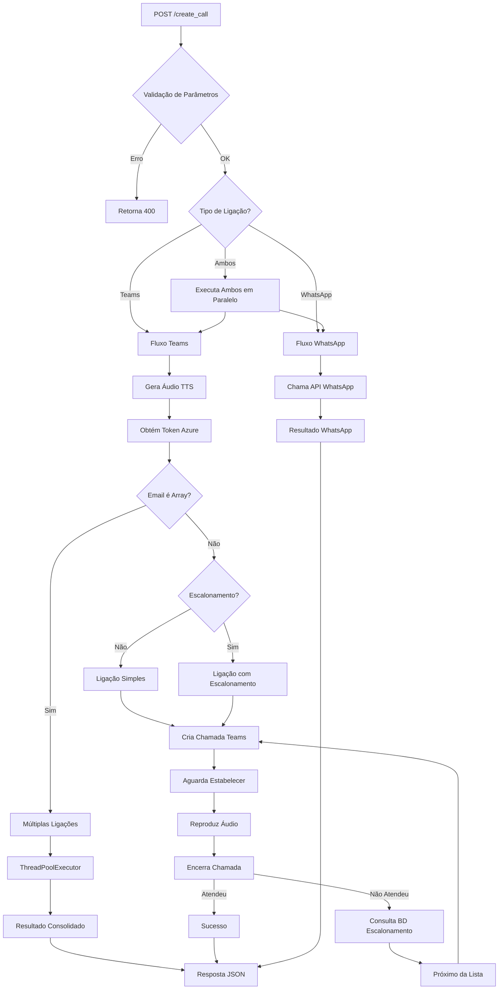
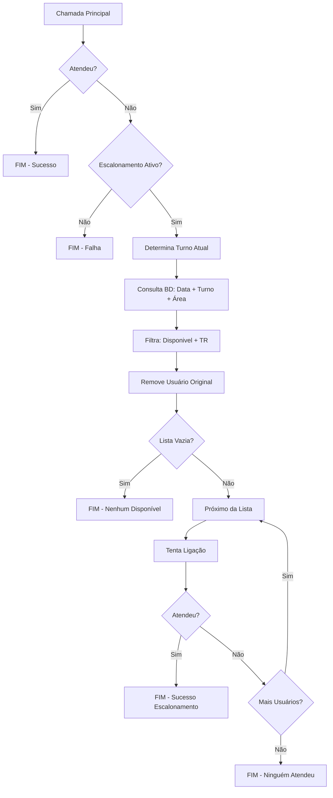
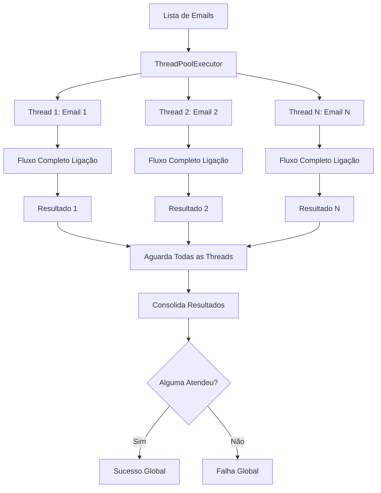
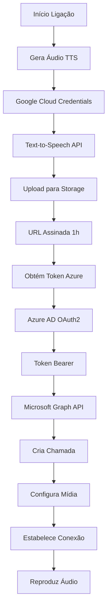
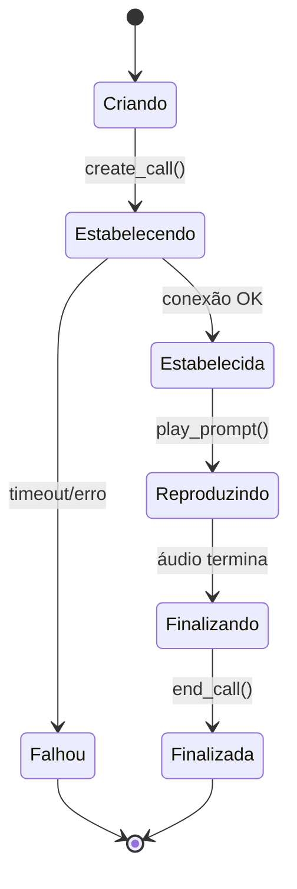

# Diagramas de Fluxo do Sistema de Ligações

## 🔄 Fluxo Principal da API

## 🎯 Fluxo de Escalonamento Detalhado

## 📱 Fluxo Múltiplas Ligações

## 🔐 Fluxo de Autenticação e Recursos

## 📊 Estados da Chamada Teams

