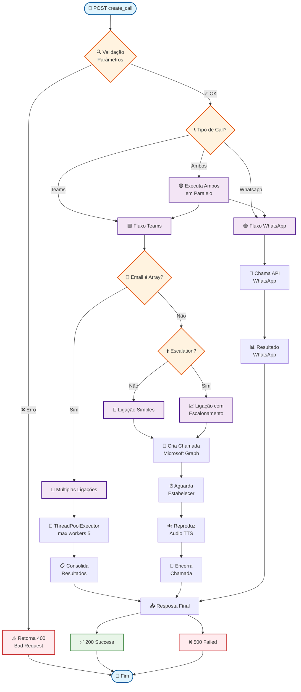
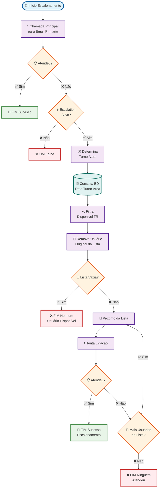
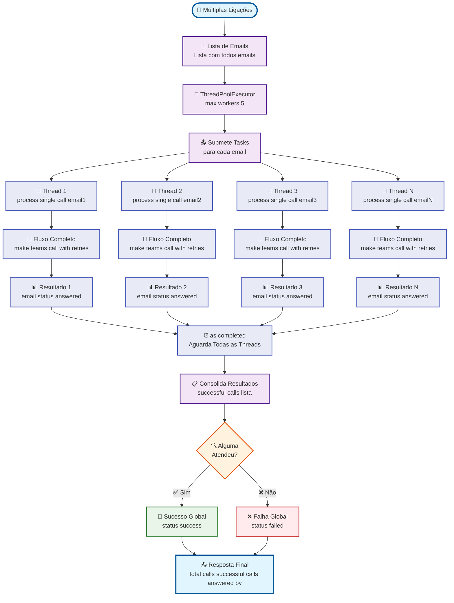
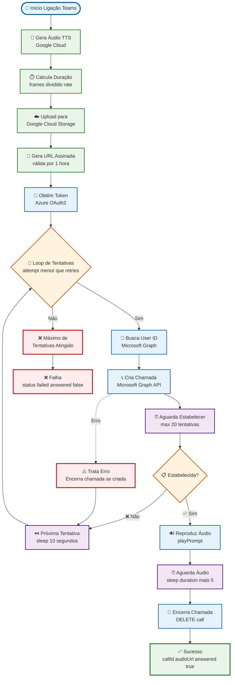
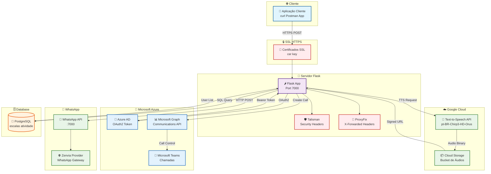
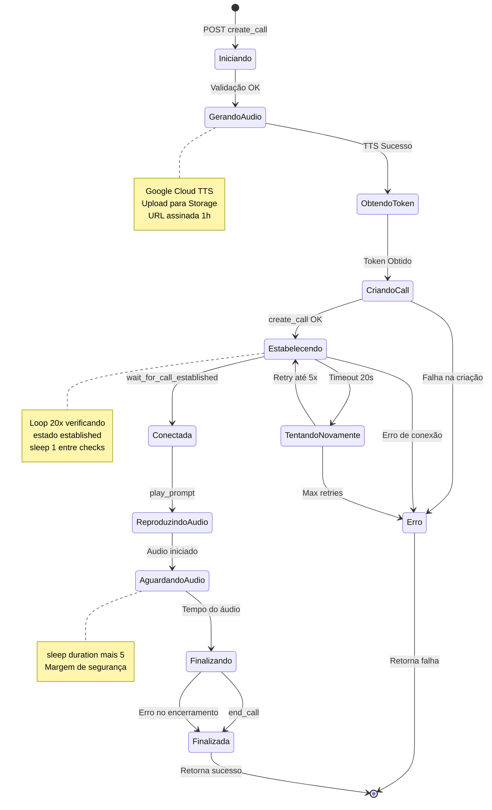
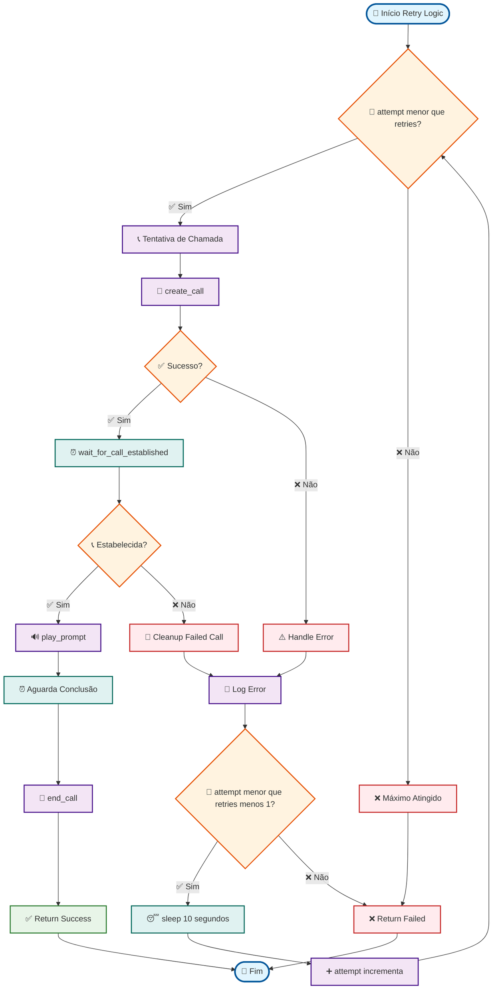

# 🎯 Fluxograma Visual Corrigido - Sistema de Ligações

## 📊 Fluxo Principal da API - Visão Geral

## 🔄 Fluxo Detalhado de Escalonamento

## 🧵 Fluxo de Múltiplas Ligações Paralelas

## 🎵 Fluxo TTS e Chamada Teams Detalhado

## 🏗️ Arquitetura do Sistema

## 📊 Estados da Chamada Teams

## 🔄 Fluxo de Retry e Recuperação

---

## 🎯 Legenda dos Símbolos

| Símbolo | Significado |
|---------|-------------|
| 🚀 | Início do processo |
| 📞 | Chamada/Ligação |
| 🔍 | Validação/Verificação |
| 🧵 | Thread/Processamento paralelo |
| ⏰ | Aguardar/Temporização |
| 🗄️ | Banco de dados |
| ☁️ | Cloud/Serviços externos |
| ✅ | Sucesso |
| ❌ | Falha/Erro |
| 🔄 | Loop/Retry |
| 📊 | Resultado/Análise |
| 🏁 | Fim do processo |

## 🔧 Correções Aplicadas

1. **Removidos caracteres especiais problemáticos:**
   - `[]` em arrays → substituído por descrição textual
   - `()` em funções → removidos ou substituídos
   - `:` em objetos JSON → substituído por descrição
   - `<>` e operadores → convertidos para texto

2. **Simplificadas expressões matemáticas:**
   - `attempt < retries` → `attempt menor que retries`
   - `duration + 5` → `duration mais 5`
   - `attempt++` → `attempt incrementa`

3. **Corrigidos nomes de nós:**
   - Removidas aspas duplas desnecessárias
   - Simplificadas descrições muito longas
   - Mantidos emojis e formatação visual

Agora todos os diagramas devem renderizar corretamente! 🎨✨
